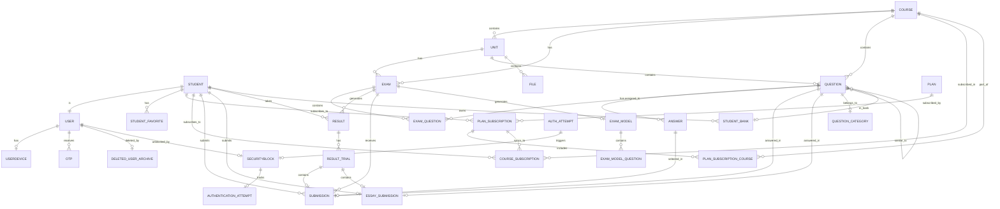

# Entity-Relationship (ER) Model

## Database Schema Overview

This document represents the complete database structure of the `american_test` Django project.

---

## ER Diagram (Mermaid Format)



---

## Tables Detail

### 1. accounts app

#### `accounts.User` (AbstractUser)
| Column | Type | Constraints | Description |
|--------|------|-------------|-------------|
| id | PK | | Primary key |
| username | VARCHAR(150) | UNIQUE, NOT NULL | Phone number |
| password | VARCHAR(128) | NOT NULL | Hashed password |
| name | VARCHAR(100) | | User full name |
| email | VARCHAR(254) | NULL | Email address |
| user_type | VARCHAR(20) | NOT NULL | 'student' or 'admin' |
| parent_phone | VARCHAR(20) | NULL | Parent phone (students only) |
| government | VARCHAR(2) | NULL | Governorate code |
| max_allowed_devices | INT | DEFAULT 2 | Max devices for students |
| is_banned | BOOLEAN | DEFAULT FALSE | Account banned status |
| banned_at | DATETIME | NULL | When banned |
| ban_reason | TEXT | NULL | Ban reason |
| is_staff | BOOLEAN | DEFAULT FALSE | Staff status |
| is_superuser | BOOLEAN | DEFAULT FALSE | Superuser status |
| created_at | DATETIME | AUTO | Account creation time |

#### `accounts.UserDevice`
| Column | Type | Constraints | Description |
|--------|------|-------------|-------------|
| id | PK | | Primary key |
| user_id | FK | → User, CASCADE | Owner user |
| device_token | VARCHAR(64) | UNIQUE | JWT device token |
| device_id | VARCHAR(255) | NULL | Mobile device ID |
| device_name | VARCHAR(255) | NULL | Device type name |
| ip_address | IPADDR | NULL | Device IP |
| user_agent | TEXT | NULL | Browser/app user agent |
| logged_in_at | DATETIME | AUTO | First login time |
| last_used_at | DATETIME | AUTO | Last API request |
| is_active | BOOLEAN | DEFAULT TRUE | Active status |
| is_banned | BOOLEAN | DEFAULT FALSE | Device banned |
| banned_at | DATETIME | NULL | When banned |
| ban_reason | TEXT | NULL | Ban reason |

#### `accounts.OTP`
| Column | Type | Constraints | Description |
|--------|------|-------------|-------------|
| id | PK | | Primary key |
| phone_number | VARCHAR(20) | NOT NULL | Recipient phone |
| otp_code | VARCHAR(6) | NOT NULL | 6-digit code |
| purpose | VARCHAR(30) | | 'signup', 'password_reset', etc. |
| user_id | FK | → User, SET NULL | Associated user |
| expires_at | DATETIME | NOT NULL | Expiration time |
| is_verified | BOOLEAN | DEFAULT FALSE | Verified status |
| verified_at | DATETIME | NULL | When verified |
| is_used | BOOLEAN | DEFAULT FALSE | Used status |
| verification_attempts | INT | DEFAULT 0 | Failed attempts |

#### `accounts.DeletedUserArchive`
| Column | Type | Constraints | Description |
|--------|------|-------------|-------------|
| id | PK | | Primary key |
| original_user_id | INT | NOT NULL | Original user ID |
| username | VARCHAR(150) | NOT NULL | Username (phone) |
| name | VARCHAR(100) | | User name |
| email | VARCHAR(254) | NULL | Email |
| user_type | VARCHAR(20) | NOT NULL | User type |
| parent_phone | VARCHAR(20) | NULL | Parent phone |
| government | VARCHAR(2) | NULL | Governorate |
| was_banned | BOOLEAN | DEFAULT FALSE | Was banned before |
| ban_reason | TEXT | NULL | Ban reason |
| original_created_at | DATETIME | NULL | Original creation |
| deleted_at | DATETIME | AUTO | Deletion time |
| is_restored | BOOLEAN | DEFAULT FALSE | Restored status |
| deleted_by_id | FK | → User, SET NULL | Admin who deleted |
| deletion_reason | TEXT | NULL | Reason for deletion |
| user_data_snapshot | JSON | | Full user data copy |

#### `accounts.SecurityBlock`
| Column | Type | Constraints | Description |
|--------|------|-------------|-------------|
| id | PK | | Primary key |
| phone_number | VARCHAR(20) | IDX | Blocked phone |
| block_type | VARCHAR(20) | | 'login', 'password_reset', 'combined' |
| blocked_at | DATETIME | AUTO | Block start |
| blocked_until | DATETIME | NOT NULL | Block end |
| block_level | INT | DEFAULT 1 | Progressive level |
| consecutive_blocks | INT | DEFAULT 1 | Consecutive count |
| is_active | BOOLEAN | DEFAULT TRUE | Active status |
| manually_unblocked | BOOLEAN | DEFAULT FALSE | Manual unblock |
| unblocked_by_id | FK | → User, SET NULL | Admin who unblocked |
| unblocked_at | DATETIME | NULL | Unblock time |
| unblock_reason | TEXT | NULL | Unblock reason |
| failed_attempts | JSON | | Attempt details |
| ip_addresses | JSON | | IPs involved |
| user_agents | JSON | | User agents |
| device_ids | JSON | | Device IDs |

#### `accounts.AuthenticationAttempt`
| Column | Type | Constraints | Description |
|--------|------|-------------|-------------|
| id | PK | | Primary key |
| phone_number | VARCHAR(20) | IDX | Attempt phone |
| attempt_type | VARCHAR(20) | | 'login', 'password_reset' |
| result | VARCHAR(20) | | 'success', 'failed', 'blocked' |
| attempted_at | DATETIME | AUTO, IDX | Attempt time |
| ip_address | IPADDR | NULL | Attempt IP |
| user_agent | TEXT | NULL | User agent |
| device_id | VARCHAR(255) | NULL | Device ID |
| failure_reason | TEXT | NULL | Failure reason |
| related_block_id | FK | → SecurityBlock, SET NULL | Related block |

---

### 2. student app

#### `student.Student`
| Column | Type | Constraints | Description |
|--------|------|-------------|-------------|
| id | PK | | Primary key |
| user_id | FK | → User, CASCADE, UNIQUE | OneToOne to User |
| name | VARCHAR(100) | NOT NULL | Student name |
| parent_phone | VARCHAR(20) | NULL | Parent contact |
| code | VARCHAR(30) | UNIQUE, NULL | Student code |
| created_at | DATETIME | AUTO | Registration time |

#### `student.StudentFavorite` (Generic)
| Column | Type | Constraints | Description |
|--------|------|-------------|-------------|
| id | PK | | Primary key |
| student_id | FK | → Student, CASCADE | Student |
| content_type_id | FK | → ContentType | Polymorphic type |
| object_id | INT | | Polymorphic ID |
| content_object | GF | | Generic foreign key |
| created_at | DATETIME | AUTO | When favorited |

---

### 3. course app

#### `course.Course`
| Column | Type | Constraints | Description |
|--------|------|-------------|-------------|
| id | PK | | Primary key |
| name | VARCHAR(150) | NOT NULL | Course name |
| description | TEXT | NULL | Description |
| image | IMAGE | NULL | Course image |
| order | INT | DEFAULT 0 | Display order |
| is_active | BOOLEAN | DEFAULT TRUE | Active status |
| created_at | DATETIME | AUTO | Creation time |
| updated_at | DATETIME | AUTO | Last update |

#### `course.Unit`
| Column | Type | Constraints | Description |
|--------|------|-------------|-------------|
| id | PK | | Primary key |
| course_id | FK | → Course, CASCADE | Parent course |
| name | VARCHAR(150) | NOT NULL | Unit name |
| description | TEXT | NULL | Description |
| order | INT | DEFAULT 0 | Display order |
| is_active | BOOLEAN | DEFAULT TRUE | Active status |
| created_at | DATETIME | AUTO | Creation time |
| updated_at | DATETIME | AUTO | Last update |

#### `course.File`
| Column | Type | Constraints | Description |
|--------|------|-------------|-------------|
| id | PK | | Primary key |
| unit_id | FK | → Unit, CASCADE | Parent unit |
| title | VARCHAR(150) | NOT NULL | File title |
| file | FILE | NOT NULL | Uploaded file |
| created_at | DATETIME | AUTO | Upload time |

---

### 4. exam app

#### `exam.Exam`
| Column | Type | Constraints | Description |
|--------|------|-------------|-------------|
| id | PK | | Primary key |
| title | VARCHAR(120) | NOT NULL | Exam title |
| description | TEXT | NULL | Description |
| related_to | VARCHAR(10) | | 'COURSE' or 'UNIT' |
| course_id | FK | → Course, CASCADE, NULL | Related course |
| unit_id | FK | → Unit, CASCADE, NULL | Related unit |
| number_of_questions | INT | DEFAULT 1 | Total questions |
| time_limit | INT | NOT NULL | Minutes |
| score | FLOAT | DEFAULT 0 | Total score |
| passing_percent | INT | DEFAULT 50 | Pass threshold |
| type | VARCHAR(10) | | 'RANDOM', 'MANUAL', 'BANK' |
| easy_questions_count | INT | DEFAULT 0 | Easy count |
| medium_questions_count | INT | DEFAULT 0 | Medium count |
| hard_questions_count | INT | DEFAULT 0 | Hard count |
| show_answers_after_finish | BOOLEAN | DEFAULT FALSE | Show answers |
| order | INT | DEFAULT 0 | Display order |
| is_active | BOOLEAN | DEFAULT TRUE | Active status |
| allow_show_results_at | DATETIME | DEFAULT NOW | When to show results |
| allow_show_answers_at | DATETIME | NULL | When to show answers |
| is_depends | BOOLEAN | DEFAULT FALSE | Depends on prev |
| show_questions_in_random | BOOLEAN | DEFAULT TRUE | Shuffle questions |
| ponus | INT | DEFAULT 0 | Bonus points |
| ponus_option | VARCHAR(30) | NULL | Bonus calculation |
| start | DATETIME | NOT NULL | Exam start |
| end | DATETIME | NOT NULL | Exam end |
| number_of_allowed_trials | INT | DEFAULT 1 | Max attempts |
| created | DATETIME | AUTO | Creation time |

#### `exam.QuestionCategory`
| Column | Type | Constraints | Description |
|--------|------|-------------|-------------|
| id | PK | | Primary key |
| title | VARCHAR(200) | NOT NULL | Category name |

#### `exam.Question`
| Column | Type | Constraints | Description |
|--------|------|-------------|-------------|
| id | PK | | Primary key |
| text | TEXT | NOT NULL | Question text |
| image | IMAGE | NULL | Question image |
| points | INT | DEFAULT 1 | Point value |
| difficulty | VARCHAR(6) | | 'EASY', 'MEDIUM', 'HARD' |
| category_id | FK | → QuestionCategory, SET NULL | Category |
| course_id | FK | → Course, CASCADE, NULL | Course |
| unit_id | FK | → Unit, CASCADE, NULL | Unit |
| question_type | VARCHAR(5) | | 'MCQ', 'ESSAY' |
| is_active | BOOLEAN | DEFAULT TRUE | Active status |
| comment | TEXT | NULL | Admin comment |
| explanation | VARCHAR(250) | NULL | Answer explanation |
| created | DATETIME | AUTO | Creation time |
| similar_questions | M2M | → Question, SELF | Similar questions |

#### `exam.Answer`
| Column | Type | Constraints | Description |
|--------|------|-------------|-------------|
| id | PK | | Primary key |
| text | TEXT | NOT NULL | Answer text |
| image | IMAGE | NULL | Answer image |
| is_correct | BOOLEAN | DEFAULT FALSE | Correct flag |
| question_id | FK | → Question, CASCADE | Parent question |
| created | DATETIME | AUTO | Creation time |

#### `exam.ExamQuestion`
| Column | Type | Constraints | Description |
|--------|------|-------------|-------------|
| id | PK | | Primary key |
| exam_id | FK | → Exam, CASCADE | Parent exam |
| question_id | FK | → Question, CASCADE | Question |
| is_active | BOOLEAN | DEFAULT TRUE | Active status |
| order | INT | DEFAULT 1 | Display order |
| created | DATETIME | AUTO | Creation time |
| updated | DATETIME | AUTO | Last update |

#### `exam.ExamModel`
| Column | Type | Constraints | Description |
|--------|------|-------------|-------------|
| id | PK | | Primary key |
| exam_id | FK | → Exam, CASCADE | Parent exam |
| title | VARCHAR(120) | NOT NULL | Model version name |
| is_active | BOOLEAN | DEFAULT TRUE | Active status |
| created | DATETIME | AUTO | Creation time |

#### `exam.ExamModelQuestion`
| Column | Type | Constraints | Description |
|--------|------|-------------|-------------|
| id | PK | | Primary key |
| exam_model_id | FK | → ExamModel, CASCADE | Parent model |
| question_id | FK | → Question, CASCADE | Question |
| is_active | BOOLEAN | DEFAULT TRUE | Active status |

#### `exam.Submission`
| Column | Type | Constraints | Description |
|--------|------|-------------|-------------|
| id | PK | | Primary key |
| student_id | FK | → Student, CASCADE | Student |
| exam_id | FK | → Exam, CASCADE | Exam |
| question_id | FK | → Question, CASCADE | Question |
| selected_answer_id | FK | → Answer, SET NULL | Selected answer |
| is_correct | BOOLEAN | DEFAULT FALSE | Correct flag |
| is_solved | BOOLEAN | DEFAULT TRUE | Solved flag |
| result_trial_id | FK | → ResultTrial, SET NULL | Trial |

#### `exam.EssaySubmission`
| Column | Type | Constraints | Description |
|--------|------|-------------|-------------|
| id | PK | | Primary key |
| student_id | FK | → Student, CASCADE | Student |
| exam_id | FK | → Exam, CASCADE | Exam |
| question_id | FK | → Question, CASCADE | Question |
| answer_text | TEXT | NOT NULL | Essay text |
| answer_file | FILE | NULL | Uploaded file |
| score | FLOAT | NULL | Awarded score |
| is_scored | BOOLEAN | DEFAULT FALSE | Scored flag |
| result_trial_id | FK | → ResultTrial, CASCADE, NULL | Trial |

#### `exam.Result`
| Column | Type | Constraints | Description |
|--------|------|-------------|-------------|
| id | PK | | Primary key |
| student_id | FK | → Student, CASCADE | Student |
| exam_id | FK | → Exam, CASCADE | Exam |
| trial | INT | DEFAULT 0 | Current trial number |
| added | DATETIME | AUTO | First attempt time |
| exam_model_id | FK | → ExamModel, SET NULL | Random model used |

#### `exam.ResultTrial`
| Column | Type | Constraints | Description |
|--------|------|-------------|-------------|
| id | PK | | Primary key |
| result_id | FK | → Result, CASCADE | Parent result |
| trial | INT | NOT NULL | Trial number |
| score | FLOAT | DEFAULT 0 | Achieved score |
| exam_score | FLOAT | DEFAULT 0 | Total exam score |
| exam_model_id | FK | → ExamModel, SET NULL | Model used |
| student_started_exam_at | DATETIME | NOT NULL | Start time |
| student_submitted_exam_at | DATETIME | NULL | Submit time |
| submit_type | VARCHAR(20) | NULL | How submitted |

#### `exam.StudentBank`
| Column | Type | Constraints | Description |
|--------|------|-------------|-------------|
| id | PK | | Primary key |
| student_id | FK | → Student, CASCADE | Student |
| question_id | FK | → Question, CASCADE | Question |
| add_reason | VARCHAR(20) | | 'UNSOLVED', 'INCORRECT' |

---

### 5. subscription app

#### `subscription.Plan`
| Column | Type | Constraints | Description |
|--------|------|-------------|-------------|
| id | PK | | Primary key |
| title | VARCHAR(150) | NOT NULL | Plan name |
| price | DECIMAL(10,2) | DEFAULT 0 | Price |
| start_day | INT | NOT NULL | Start day of month |
| start_month | INT | NOT NULL | Start month |
| end_day | INT | NOT NULL | End day of month |
| end_month | INT | NOT NULL | End month |
| number_of_allowed_courses_to_subscribe | INT | DEFAULT 1 | Max courses |
| is_active | BOOLEAN | DEFAULT TRUE | Active status |
| created_at | DATETIME | AUTO | Creation time |
| updated_at | DATETIME | AUTO | Last update |

#### `subscription.PlanSubscription`
| Column | Type | Constraints | Description |
|--------|------|-------------|-------------|
| id | PK | | Primary key |
| student_id | FK | → Student, CASCADE | Subscriber |
| plan_id | FK | → Plan, PROTECT | Plan |
| payment_status | VARCHAR(20) | DEFAULT 'pending' | Payment state |
| easypay_invoice_uid | VARCHAR(120) | NULL | EasyPay UID |
| easypay_invoice_sequence | VARCHAR(120) | NULL | EasyPay sequence |
| easypay_payment_url | URL | NULL | Payment URL |
| easypay_payload | JSON | | Raw response |
| paid_at | DATETIME | NULL | Payment time |
| created_at | DATETIME | AUTO | Creation time |
| updated_at | DATETIME | AUTO | Last update |

#### `subscription.PlanSubscriptionCourse` (Through)
| Column | Type | Constraints | Description |
|--------|------|-------------|-------------|
| id | PK | | Primary key |
| subscription_id | FK | → PlanSubscription, CASCADE | Subscription |
| course_id | FK | → Course, CASCADE | Course |
| created_at | DATETIME | AUTO | Creation time |

#### `subscription.CourseSubscription`
| Column | Type | Constraints | Description |
|--------|------|-------------|-------------|
| id | PK | | Primary key |
| student_id | FK | → Student, CASCADE | Student |
| course_id | FK | → Course, CASCADE | Course |
| plan_subscription_id | FK | → PlanSubscription, CASCADE, NULL | Source subscription |
| active | BOOLEAN | DEFAULT TRUE | Access active |
| created_at | DATETIME | AUTO | Creation time |

---

## Relationship Summary

```
USER (accounts)
├── 1:1 → Student (student)
├── 1:N → UserDevice (accounts)
├── 1:N → OTP (accounts)
├── 1:N → DeletedUserArchive (accounts)
└── 1:N → SecurityBlock (accounts)

STUDENT (student)
├── 1:N → StudentFavorite (student)
├── 1:N → PlanSubscription (subscription)
├── 1:N → CourseSubscription (subscription)
├── 1:N → Submission (exam)
├── 1:N → EssaySubmission (exam)
├── 1:N → Result (exam)
└── 1:N → StudentBank (exam)

COURSE (course)
├── 1:N → Unit (course)
├── 1:N → Exam (exam)
├── 1:N → Question (exam)
└── 1:N → CourseSubscription (subscription)

UNIT (course)
├── 1:N → Exam (exam)
├── 1:N → Question (exam)
└── 1:N → File (course)

EXAM (exam)
├── 1:N → ExamQuestion (exam)
├── 1:N → Result (exam)
├── 1:N → Submission (exam)
└── 1:N → ExamModel (exam)

QUESTION (exam)
├── 1:N → Answer (exam)
├── 1:N → ExamQuestion (exam)
└── 1:N → Submission (exam)

RESULT (exam)
└── 1:N → ResultTrial (exam)

PLAN (subscription)
└── 1:N → PlanSubscription (subscription)

PLAN_SUBSCRIPTION (subscription)
├── 1:N → PlanSubscriptionCourse (subscription)
└── 1:N → CourseSubscription (subscription)
```

---

## Indexes Summary

| Table | Index Fields |
|-------|-------------|
| UserDevice | (user, device_id, is_active), (user, ip_address, is_active) |
| OTP | (phone_number, purpose, -created_at), (phone_number, is_used, is_verified) |
| SecurityBlock | (phone_number, is_active), (phone_number, block_type, is_active), (-blocked_at), (blocked_until) |
| AuthenticationAttempt | (phone_number), (attempted_at) |
| Submission | (student, exam), (result_trial, is_correct), (question, is_correct), (student, is_correct, is_solved), UNIQUE(student, exam, question, result_trial) |
| EssaySubmission | UNIQUE(student, exam, question, result_trial) |
| Result | UNIQUE(student, exam), (student, exam), (trial, added), (added, student) |
| ResultTrial | UNIQUE(result, trial) |
| ExamModelQuestion | (exam_model, is_active), (question, is_active), UNIQUE(exam_model, question) |
| Question | (question_type, is_active), (is_active, question_type), (id, is_active, question_type), (course, is_active, question_type), (unit, is_active, question_type), (category, is_active, question_type) |
| StudentFavorite | UNIQUE(student, content_type, object_id) |
| CourseSubscription | UNIQUE(student, course, plan_subscription) |
| PlanSubscriptionCourse | UNIQUE(subscription, course) |
