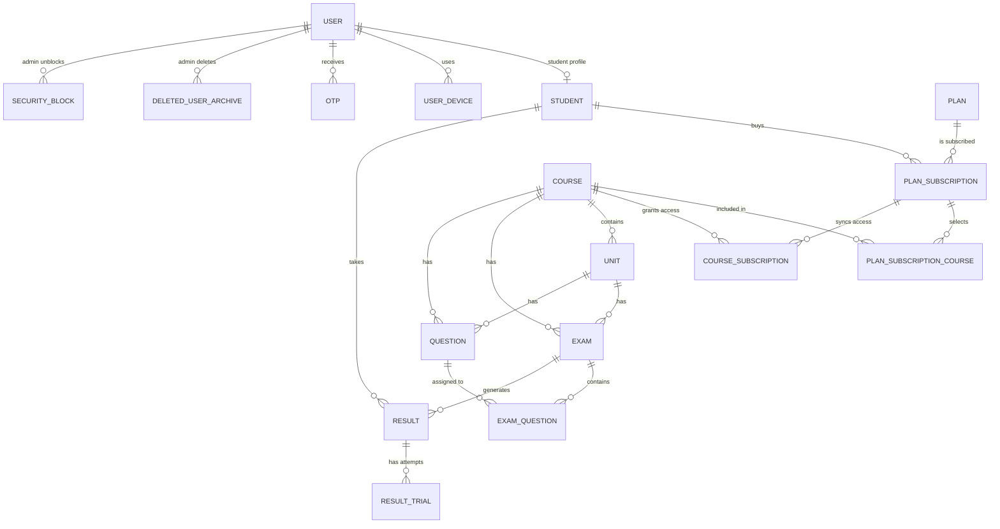
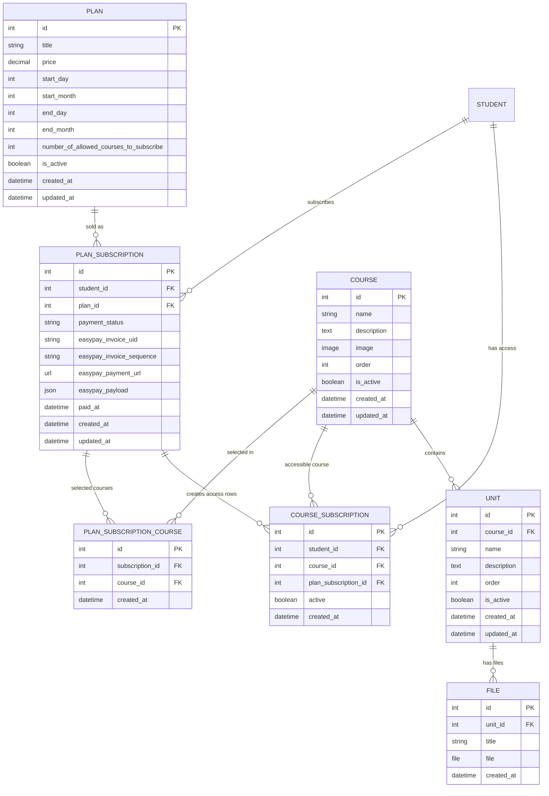
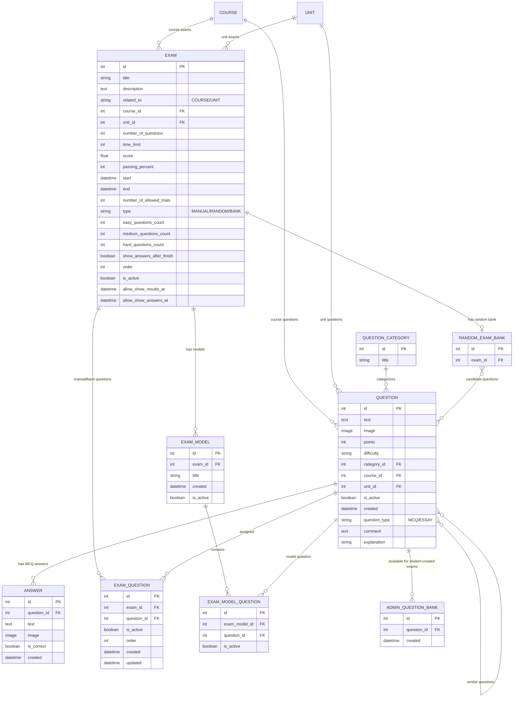
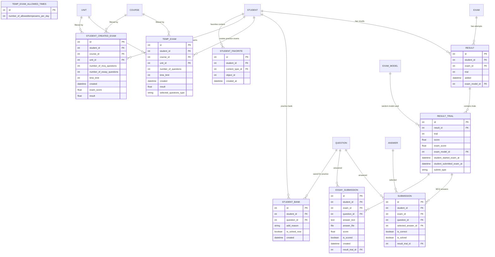

# American TEST ER Model Design

This document is a manager-facing ER design for the American TEST platform. It focuses on the real business domain: students subscribe to plans, choose allowed courses, and access course/unit exams. Staff users manage courses, units, plans, questions, exams, results, devices, bans, and security controls.

## Scope Notes

- There are no teachers, academic years, divisions, lessons, videos, or profile images in this data model.
- A `User` can be a student or an admin/staff user.
- A student is represented by `Student`, which is a one-to-one extension of `User`.
- Plans use day/month availability windows only. The effective year is calculated at runtime.
- A paid plan subscription grants access only to the selected courses, up to the plan course limit.
- Exams and questions can be related to a course directly or to a unit under a course.
- Students can take assigned course/unit exams, create temporary practice exams from their student bank, and create custom exams from the admin question bank.

## High-Level Domain Map



## Accounts And Security

```mermaid
erDiagram
    USER {
        int id PK
        string username UK "phone number"
        string name
        string email
        string user_type "student/admin"
        string parent_phone
        string government
        int max_allowed_devices
        boolean is_banned
        datetime banned_at
        text ban_reason
        boolean is_staff
        boolean is_superuser
        datetime created_at
    }

    STUDENT {
        int id PK
        int user_id FK UK
        string name
        string parent_phone
        string code UK
        datetime created_at
    }

    USER_DEVICE {
        int id PK
        int user_id FK
        string device_token UK
        string device_id
        string device_name
        string ip_address
        text user_agent
        json device_info
        datetime logged_in_at
        datetime last_used_at
        boolean is_active
        boolean is_banned
        datetime banned_at
        text ban_reason
    }

    OTP {
        int id PK
        string phone_number
        string otp_code
        string purpose
        int user_id FK
        datetime created_at
        datetime expires_at
        boolean is_verified
        datetime verified_at
        boolean is_used
        datetime used_at
        int verification_attempts
    }

    SECURITY_BLOCK {
        int id PK
        string phone_number
        string block_type
        datetime blocked_at
        datetime blocked_until
        int block_level
        int consecutive_blocks
        boolean is_active
        boolean manually_unblocked
        int unblocked_by_id FK
        datetime unblocked_at
        text unblock_reason
        json failed_attempts
        json ip_addresses
        json user_agents
        json device_ids
    }

    AUTHENTICATION_ATTEMPT {
        int id PK
        string phone_number
        string attempt_type
        string result
        datetime attempted_at
        string ip_address
        text user_agent
        string device_id
        text failure_reason
        int related_block_id FK
    }

    DELETED_USER_ARCHIVE {
        int id PK
        int original_user_id
        string username
        string name
        string email
        string user_type
        string parent_phone
        string government
        boolean was_banned
        text ban_reason
        datetime original_created_at
        datetime deleted_at
        boolean is_restored
        int deleted_by_id FK
        text deletion_reason
        json user_data_snapshot
    }

    USER ||--o| STUDENT : "has student profile"
    USER ||--o{ USER_DEVICE : "has devices"
    USER ||--o{ OTP : "receives OTPs"
    USER ||--o{ DELETED_USER_ARCHIVE : "deleted by admin"
    USER ||--o{ SECURITY_BLOCK : "unblocked by admin"
    SECURITY_BLOCK ||--o{ AUTHENTICATION_ATTEMPT : "blocks attempts"
```

## Plans, Courses, And Access



## Exam Authoring



## Student Exam Activity



## Access Rules Summary

| Rule | Data Involved |
|---|---|
| A student can subscribe to a plan and select courses up to the plan limit. | `Plan`, `PlanSubscription`, `PlanSubscriptionCourse` |
| Course access starts only when payment is paid/manual and the plan date window is currently active. | `PlanSubscription.payment_status`, `Plan.start_day/start_month/end_day/end_month`, `CourseSubscription.active` |
| A student loses access when the plan end date passes, even if they subscribed late. | Runtime plan availability calculation |
| Exams are visible/accessed only through selected paid course access. | `CourseSubscription`, `Exam.course`, `Exam.unit.course` |
| Admins create course/unit questions and attach them to manual/bank exams. | `Question`, `Answer`, `ExamQuestion` |
| Random exams use a random bank and optional models. | `RandomExamBank`, `ExamModel`, `ExamModelQuestion` |
| Wrong or unsolved student answers feed the student practice bank. | `Submission`, `EssaySubmission`, `StudentBank` |
| Students can generate practice exams from their own bank. | `StudentBank`, `TempExam` |
| Students can generate custom exams from the admin question bank. | `AdminQuestionBank`, `StudentCreatedExam` |
| Device limits, device bans, account bans, OTP, and security blocks are account-level controls. | `UserDevice`, `OTP`, `SecurityBlock`, `AuthenticationAttempt` |

## Review Notes

- The model intentionally keeps payments on `PlanSubscription`, not on courses or exams.
- `CourseSubscription` is a synchronized access/cache row derived from paid plan subscriptions.
- `Question.course` is automatically set from `Question.unit.course` when a question is unit-related.
- `Exam.course` is automatically set from `Exam.unit.course` for unit exams, making access checks easier.
- `TempExamAllowedTimes` is a singleton configuration table.
